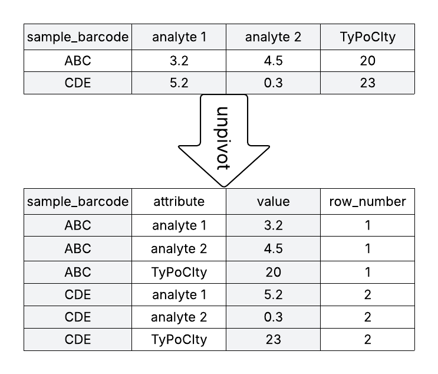
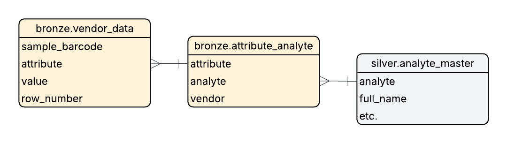

# The Zen of the Bronze Layer: Embracing Schema Chaos

In [Part 1](./001_medallion.md), we introduced the Medallion Architecture with clean, well-behaved vendor data. In [Part 2](./002_bronze_chaos.md), we watched the bronze layer transform from "just land the data" into an eight-step ingestion pipeline with vendor-specific logic, fuzzy matching heuristics, header detection, and character sanitization. The final form barely resembles the simple bronze layer from Part 1. We ended by asking uncomfortable questions about whether we're still preserving "raw" data, and what happens when Vendor C arrives.

This post answers the question we left hanging: What if we stop treating column names as schema and start treating them as data?

## The Cognitive Shift

Traditional thinking treats CSV column names as schema constraints. You design a bronze table with specific columns (ph, copper_ppm, zinc_ppm), and vendor data either fits that schema or requires transformation to match it. When Vendor B calls their pH column "acidity" instead, you write mapping logic. When schemas change between analysis packages, you build superset schemas that accommodate all possible columns. When typos appear, you add fuzzy matching.

Each vendor variation becomes a code problem requiring a code solution.

Consider what happens as this approach scales. With two vendors and two analysis packages each, you manage four schema mappings. Add a third vendor with three packages, and you're at nine. The combination space grows faster than the vendor count. Testing requires sample files for every vendor/package/quirk combination; the test matrix explodes exponentially.

The fundamental issue is treating column names as structural constraints when they're actually metadata about measurements.

## What "Raw" Actually Means

When vendors send CSV files, they're dumping data from lab systems or Excel into whatever format was easiest to export. The wide CSV format (one column per measurement) is convenient for humans viewing spreadsheets, but it creates a problem: semantics are encoded in structure.

Consider what this means in practice. Column positions and names carry meaning; you need to know that the third column represents copper measurements before you can interpret the value 10.2. This encoding is precisely what created the brittleness we fought in Part 2.

Here's a deceptively simple question: What is the "raw" form of vendor data? Is it the wide CSV they sent, or is it the atomic facts before they got serialized into columns?

Consider this sample from Vendor A:

```csv
sample_barcode,ph,copper_ppm,zinc_ppm
ABC123,6.5,10.2,15.3
DEF456,7.2,8.7,12.1
```

The "raw" facts are: Sample ABC123 has a pH of 6.5, copper of 10.2, and zinc of 15.3. The wide format is a presentation choice, not the essential structure. Column names are data labels that happen to be stored as structural metadata.

What if we unpivoted this into long format?

```csv
sample_barcode,attribute,value,row_number
ABC123,ph,6.5,1
ABC123,copper_ppm,10.2,1
ABC123,zinc_ppm,15.3,1
DEF456,ph,7.2,2
DEF456,copper_ppm,8.7,2
DEF456,zinc_ppm,12.1,2
```

Now column names are data in the `attribute` field. The structure describes position and value; semantics come from the attribute values themselves.



This transformation is called unpivoting (or melting). It converts wide format into long format by treating each cell as an individual record with explicit position tracking.

## The Power of Vendor-Agnostic Structure

This pattern isn't novel; it's a variant of the Entity-Attribute-Value (EAV) model that's been used in database design for decades, particularly in healthcare and scientific domains where schemas are highly variable. In simpler terms, we're storing key-value pairs with position metadata. The statistical community calls this "long format" or "tidy data"; database architects call it "vertical storage." The concept is well-established; what's perhaps less common is applying it specifically to bronze layer ingestion as a solution to vendor schema chaos.

Once data is in long format, the bronze table schema becomes fixed and vendor-agnostic:

- `row_index`: Position in the original file
- `column_index`: Column position in the original file
- `lab_provided_attribute`: The exact column name the vendor used
- `lab_provided_value`: The measurement value
- `vendor_id`: Which vendor sent this data
- `file_name`: Source file name
- `ingestion_timestamp`: When we received it

Every vendor file, regardless of its schema, gets transformed into this same structure. Vendor A sends pH as "ph"? That goes in `lab_provided_attribute`. Vendor B sends it as "acidity"? That also goes in `lab_provided_attribute`. Typo it as "recieved_date"? Preserved exactly as received in `lab_provided_attribute`.

The schema chaos doesn't disappear; we've stopped fighting it by encoding it as data instead of structure. The bronze layer no longer needs to know what "ph" or "acidity" mean. It just preserves attribute/value pairs with position metadata.

This has profound implications:

**No vendor-specific logic:** The same unpivot transformation works for every vendor. No if/elif branches based on vendor_name.

**No superset schemas:** The bronze table doesn't grow new columns when vendors add measurements. Additional measurements just create more rows.

**No fuzzy matching:** Typos are preserved as-is in `lab_provided_attribute`. We're not making quality decisions about which variations are "close enough."

**No header detection complexity:** While we still need to find the header row, once found, every column gets the same treatment. There's no domain knowledge about which columns are measurements versus metadata.

The unpivot pattern trades structural rigidity for structural consistency. Instead of a brittle schema that breaks with variations, we have a flexible schema that accepts any variation and pushes semantic interpretation to the silver layer.

## Implementation: The CSV Table Parser

Having established why column names should be data, let's examine how to actually implement this transformation. The unpivot process has three steps: find the header row, clean up the structure, and transform wide to long.

The [CSVTableParser](../src/parse/base.py) uses Python's standard `csv` module rather than pandas or Spark for initial parsing. This matters: pandas and Spark make assumptions about data types and structure that interfere with preserving data exactly as received. The csv module gives us raw strings without interpretation.

### Finding the Header Row

CSV files from vendors often have metadata rows above the actual data header. Vendor A might include "Lab Report Generated: 2024-01-15" in row 1, with the real header in row 3. Rather than hardcoding vendor-specific knowledge about metadata row patterns, the parser uses a simple heuristic: the header row is the first row with a sufficient number of non-null columns.

```python
def remove_header(self, records: list[list[Any]], min_found: int = 10) -> list[list[Any]]:
    """
    Find the first row with enough non-null values to be considered the header
    """
    header_index = None

    for i, row in enumerate(records):
        non_nulls = sum(item is not None for item in row)
        if non_nulls >= min_found:
            header_index = i
            break

    if header_index is None:
        raise ValueError("Could not find header row.")

    return records[header_index:]
```

The threshold (`min_found`) is configurable, not embedded in code. If Vendor A typically has 15 columns and Vendor B has 8, you can initialize the parser with different thresholds: `CSVTableParser({"header_detection_threshold": 15})` for Vendor A and `CSVTableParser({"header_detection_threshold": 7})` for Vendor B. This is configuration data, not branching logic. The algorithm remains the same; only the parameter changes.

Contrast this with Part 2's approach, where header detection logic might have vendor-specific if/elif branches checking for patterns like "Lab Report Generated" (Vendor A's metadata format) versus "Analysis Date" (Vendor B's format). Configurable thresholds let you adapt to vendor differences without encoding vendor knowledge into the codebase.

### Cleaning Column Structure

Vendors sometimes export CSVs with empty columns (extra commas creating phantom columns) or duplicate column names. The parser drops empty columns and deduplicates names:

```python
def clean_columns(self, records: list[list[Any]]) -> list[list[Any]]:
    """Drop empty columns and deduplicate column names"""
    # Drop columns where header is None
    cols_to_drop = [
        index for index, column in enumerate(records[0]) if column is None
    ]
    records = [
        [item for index, item in enumerate(row) if index not in cols_to_drop]
        for row in records
    ]

    # Deduplicate column names by appending _1, _2, etc.
    records[0] = self._dedupe_columns(records[0])

    return records
```

If a vendor's export includes duplicate column names (perhaps two "notes" columns), they become "notes" and "notes_1". The structure is preserved, not rejected.

### The Unpivot Transformation

This is where wide format becomes long format. Each cell in the original table becomes a row in the output:

```python
def unpivot(self, records: list[list[Any]]) -> list[dict[str, Any]]:
    """Transform wide format to long format with position tracking"""
    results = []
    attributes = records[0]
    for row_index, row in enumerate(records[1:], start=1):
        for column_index, (attribute, value) in enumerate(
            zip(attributes, row), start=1
        ):
            results.append({
                "row_index": row_index,
                "column_index": column_index,
                "lab_provided_attribute": attribute,
                "lab_provided_value": value,
            })

    return results
```

The loop structure is straightforward: for each row (starting from row 1 after the header), for each column, create a record with the position (row_index, column_index), the attribute name, and the value. A 50-row CSV with 20 columns becomes 1,000 records (50 × 20).

Position tracking matters. `row_index` and `column_index` preserve the original structure. If an issue appears with a measurement, you can trace it back to the exact cell in the source file (row 42, column 7). This is critical for debugging and audit trails.

### Bronze Ingestion: One Loop for All Vendors

With the CSVTableParser handling the transformation, bronze ingestion becomes remarkably simple. Here's the actual code from our [demo notebook](../notebooks/003_bronze_silver_unpivot_demo.py):

```python
# Initialize parser with configuration
parser = CSVTableParser({"header_detection_threshold": 5})

# Track ingestion timestamp
ingestion_timestamp = datetime.now()

# Collect all parsed records
all_records = []

# Process each vendor file
for file_name in vendor_files:
    # Get file path
    csv_file_path = get_csv_file_path(f"{VOLUME_PATH}/{file_name}")

    # Parse and unpivot
    records = parser.parse(csv_file_path)

    # Add metadata to each record
    vendor_id = extract_vendor_id(file_name)
    for record in records:
        record["vendor_id"] = vendor_id
        record["file_name"] = file_name
        record["ingestion_timestamp"] = ingestion_timestamp

    all_records.extend(records)

# Create bronze table from all records
spark_df_bronze = spark.createDataFrame(all_records, schema=bronze_schema_def)
spark_df_bronze.write.format("delta").mode("overwrite").saveAsTable(bronze_table_name)
```

This same loop processes 11 different vendor files:
- Vendor A: basic_clean, full_clean, messy_typos, messy_casing, messy_whitespace, excel_nightmare
- Vendor B: standard_clean, full_clean, messy_combo, excel_disaster, db_nightmare

No vendor-specific branches. No analysis package logic. No special handling for typos or special characters. The parser treats every file identically; the bronze layer preserves everything as data.

Compare this to the eight-step bronze function from Part 2 with its vendor-specific mappings, superset schema alignment, fuzzy matching, and character sanitization. The unpivot approach collapses all that complexity into a single generic transformation.

## Silver Layer: Standardization Through Data

Bronze preserves chaos; silver brings order. The key insight is that standardization happens through data (mapping tables), not code (if/elif logic).

The unpivoted bronze table contains `lab_provided_attribute` values like "ph", "acidity", "copper_ppm", "cu_total". These mean different things structurally (they're different column names) but the same thing semantically (pH and copper measurements). The silver layer resolves this semantic ambiguity through two tables: vendor-analyte mapping and analyte dimension.

### Vendor-Analyte Mapping Table

This [mapping table](../src/labforge/metadata.py) connects vendor-specific column names to canonical analyte identifiers:

| vendor_id | vendor_column_name | analyte_id | notes |
|-----------|-------------------|------------|-------|
| vendor_a  | ph                | a94a8fe5   | Direct pH measurement |
| vendor_a  | copper_ppm        | f1e2d3c4   | Copper reported in ppm |
| vendor_b  | acidity           | a94a8fe5   | pH reported as 'acidity' |
| vendor_b  | cu_total          | f1e2d3c4   | Total copper using chemical symbol |

Notice that "ph" and "acidity" both map to the same `analyte_id` (a94a8fe5). The mapping table captures domain knowledge: despite different names, both columns represent pH measurements. Similarly, "copper_ppm" and "cu_total" share analyte_id f1e2d3c4.

This is configuration data, not logic. When Vendor C arrives calling pH "pH_level", you add a row to the mapping table. No code changes required.

### Analyte Dimension Table

The analyte dimension provides canonical metadata about each measurement:

| analyte_id | analyte_name | unit | data_type | min_valid_value | max_valid_value |
|-----------|--------------|------|-----------|----------------|-----------------|
| a94a8fe5  | pH           |      | numeric   | 0.0            | 14.0            |
| f1e2d3c4  | Copper       | ppm  | numeric   | 0.0            | 100.0           |
| b3c8d1e7  | Zinc         | ppm  | numeric   | 0.0            | 200.0           |

This table defines what each analyte actually represents: its standard name, unit of measurement, expected data type, and valid ranges. These are reference data that data stewards can manage without deploying code.



### The Silver Transformation

Joining bronze with these mapping tables produces standardized measurements. Here's the SQL pattern:

```sql
CREATE TABLE silver.lab_samples_standardized AS
SELECT
    -- Original bronze columns for lineage
    b.row_index,
    b.column_index,
    b.lab_provided_attribute,
    b.lab_provided_value,
    b.vendor_id,
    b.file_name,
    b.ingestion_timestamp,
    -- Standardized analyte information
    a.analyte_id,
    a.analyte_name,
    a.unit,
    a.data_type,
    a.min_valid_value,
    a.max_valid_value
FROM bronze.lab_samples_unpivoted b
LEFT JOIN bronze.vendor_analyte_mapping m
    ON b.lab_provided_attribute = m.vendor_column_name
    AND b.vendor_id = m.vendor_id
LEFT JOIN silver.analyte_dimension a
    ON m.analyte_id = a.analyte_id;
```

The left join pattern is intentional. Not every bronze attribute maps to an analyte; metadata columns like "sample_barcode", "lab_id", and "date_received" won't have analyte mappings. These rows get NULL for analyte_id, which is expected and fine. You can filter for `analyte_id IS NOT NULL` to get just the measurements, or keep everything for complete lineage.

After this transformation, you have:
- **Original context preserved:** The exact column name vendor used (`lab_provided_attribute`), the vendor_id, file_name, and ingestion_timestamp
- **Standardized semantics added:** Canonical analyte_name, unit, and validation metadata
- **Cross-vendor comparability:** pH measurements from both vendors now share the same analyte_name and analyte_id

### What We've Achieved

The silver layer demonstrates three architectural principles:

**Configuration over code:** Vendor differences are expressed as rows in mapping tables, not if/elif branches in functions. Adding a vendor means inserting rows; changing how a vendor names their columns means updating rows. Database operations, not deployments.

**Separation of concerns:** Bronze handles structure preservation (unpivoting). Silver handles semantic interpretation (mapping). Each layer has a single, clear responsibility.

**Data-driven evolution:** The mapping tables are versioned data that can be managed by data stewards, not just engineers. Domain experts can maintain vendor-to-analyte mappings without understanding the ingestion code.

Vendor-specific knowledge still exists; we haven't eliminated the need to understand that "acidity" means pH. But we've moved that knowledge from code (brittle, requires deployments) to data (flexible, requires inserts/updates).

## Rethinking "Raw" Data

The unpivot pattern raises deeper questions about data engineering philosophy. Part 2 ended by questioning whether the complex eight-step bronze layer was still preserving "raw" data. This pattern forces a more careful definition of what "raw" actually means.

When vendors export CSVs, they're likely just dumping data from Excel or their lab information systems without much thought. The wide format (one column per measurement) is convenient for humans viewing spreadsheets, but it encodes domain knowledge into structure. To understand that the third column represents copper measurements, you need to read the header; the column position itself carries no semantic meaning.

The unpivot transformation exposes the atomic facts hiding in this structure: this sample, this attribute, this value, at this position. Column names stop being structural constraints and become data values we can query, filter, and join against. Whether a vendor calls it "ph" or misspells it as "pH_lvl", it's just a string value in `lab_provided_attribute`.

In this sense, unpivoted bronze is closer to "raw" than wide bronze. The messiness doesn't disappear; it becomes explicit. Typos appear as queryable data in `lab_provided_attribute` rather than as structural variations that break schema assumptions.

### The Paradox of Control

The unpivot pattern presents a paradox: by giving up control (accepting any schema), we gain control (one ingestion pattern).

Part 2's approach tried to control vendor chaos through transformation logic: detect headers, fix typos, sanitize characters, map column names, align to superset schemas. Each transformation attempted to force vendor data into expected structure, making the system increasingly fragile.

In contrast, the unpivot approach accepts vendor chaos by treating it as data to preserve rather than problems to solve. Bronze doesn't validate column names or fix typos; those are silver layer concerns solved through mapping tables. When vendor schemas change, bronze doesn't break. It just creates different `lab_provided_attribute` values, and the mapping tables handle semantic evolution without code changes.

### When Schemas Are Data, Not Code

Traditional databases treat schemas as structural constraints: the CREATE TABLE statement defines columns, and INSERT statements must conform. The unpivot pattern inverts this. The bronze schema (row_index, column_index, lab_provided_attribute, lab_provided_value) is fixed, but what constitutes valid data is open-ended. Any attribute name is acceptable.

This inversion has significant implications:

**Adding vendors becomes a data operation.** Add rows to vendor_analyte_mapping; the new vendor's data flows through unchanged code paths.

**Schema changes become data operations.** Vendor renames "ph" to "pH_value"? Update vendor_analyte_mapping. No deployment required.

**Historical analysis becomes possible.** Version the mapping table to track how vendor column naming evolved over time.

**Testing becomes systematic.** Test the generic unpivot transformation once; vendor differences are data fixtures, not code paths.

The cognitive shift is recognizing that vendor quirks are metadata about their export process, not structural properties of the data itself.

### Reclaiming the Bronze Layer

Part 2 asked: "Is this still a bronze layer?" after watching transformation logic accumulate. The unpivot pattern reclaims bronze simplicity by giving it one job: parse CSV structure and preserve information as position/value pairs. No quality decisions about typos. No business logic about semantics. Just structural transformation from wide to long format.

This IS minimal transformation. Values aren't modified; only their organization changes. The transformation is generic (same code for all vendors) and reversible (pivot back using row_index and column_index).

Silver handles semantic complexity through mapping tables. Gold does analysis and aggregation. Each layer has clear boundaries and single responsibilities.

## When NOT to Use This Pattern

The unpivot pattern solves specific problems; it's not a universal solution. Recognizing when it adds unnecessary complexity is as important as knowing when it provides value.

### Important Caveat: This Is an Intermediate Form

The unpivot pattern creates long-format data as an intermediate representation. You don't stop here; silver and gold layers transform this back into analyst-friendly structures (wide tables, aggregations, dimensional models). If you're not building a multi-stage transformation pipeline where bronze feeds silver feeds gold (or marts in other architectural patterns), unpivoting adds unnecessary complexity without delivering its benefits. The pattern makes sense when you have layer separation and further transformations; it's the wrong tool if you need a simple data landing zone for direct consumption.

### Don't Use Unpivot When Schemas Are Stable

If you work with one or two vendors who provide stable schemas that rarely change, the unpivot pattern may be unnecessary overhead. When Vendor A's contract specifies that `copper_ppm` won't change without notice and you haven't seen schema drift in two years, simpler approaches suffice.

Similarly, at low volume (say, 500 samples per month from two stable vendors), the unpivot infrastructure might cost more to build and maintain than occasional vendor-specific adjustments. The pattern's benefits scale with schema chaos; if you don't have chaos, you don't need the solution.

### Do Use Unpivot When Schema Chaos Is Real

Conversely, use the pattern when:

**You have multiple vendors with divergent naming conventions.** Three vendors calling pH by three different names; vendor-specific if/elif logic is already feeling brittle and hard to maintain.

**Schemas change frequently within vendors.** Same vendor sends different column sets based on analysis package ordered, or evolves their format quarterly without coordination.

**You're building for extensibility.** You expect vendor count to grow, or you're building a platform where schema flexibility is a product feature, not just a maintenance challenge.

**You need complete provenance.** Regulatory requirements demand preserving exact column names as received, with full traceability to source files and cells. The unpivot pattern with position tracking provides audit-grade lineage.

**Standardization requires domain expertise.** Mapping between vendor terminologies involves domain knowledge that should be managed by data stewards as reference data, not hardcoded by engineers in transformation logic.

### The Decision Framework

Ask yourself:
1. How many vendors do you have (current and expected in 2 years)?
2. How often do schemas change, and how coordinated are those changes?
3. Are you building a multi-stage transformation pipeline with proper layer separation?
4. What are your provenance and audit requirements?
5. What's the actual cost of schema-related maintenance today?

If the answers suggest high vendor count, frequent uncoordinated schema changes, multi-stage architecture, strong audit needs, and meaningful current maintenance burden, the unpivot pattern likely pays dividends. If answers point toward stability, predictability, and simple requirements, simpler approaches might suffice.

There's no universal answer; architectural decisions require weighing specific context and constraints.

## The Zen of It

Part 2 ended with vendor-specific logic, superset schemas, fuzzy matching, and character sanitization accumulating until we questioned what "bronze" even meant. The solution wasn't more sophisticated logic; it was reframing the problem entirely.

By treating column names as data instead of schema, we eliminated brittleness without eliminating complexity. Vendor chaos still exists, but it's no longer a code problem. Column name variations become rows in mapping tables. Schema evolution becomes data updates, not deployments. The complexity moves from scattered if/elif logic into structured dimension tables managed by people who understand vendor semantics.

This reveals a broader principle: sometimes the elegant solution isn't solving the problem, it's reframing what the problem actually is. Schema chaos looked like a structural problem requiring sophisticated transformation logic. Reframed as a metadata problem, it becomes manageable through configuration.

The paradoxes stack up: by giving up control (accepting any schema), we gain control (one ingestion path). By preserving more of what vendors send (typos included), we achieve better standardization (explicit mapping, not implicit assumptions). By doing less transformation in bronze, we enable cleaner layer separation.

Data engineering is about finding the right abstraction level. Too concrete and you drown in special cases. Too abstract and you can't solve actual problems. The unpivot pattern finds the middle ground: generic enough to handle any vendor's wide CSV, specific enough to preserve structure and position.

The code is simpler. The testing is systematic. The evolution path is clear. That's finding zen in apparent chaos.

---

**Complete working example:** The [demo notebook](../notebooks/003_bronze_silver_unpivot_demo.py) processes 11 vendor files (clean, messy, typos, Excel nightmares) using the patterns described in this post. The [CSVTableParser](../src/parse/base.py) and [mapping tables](../src/labforge/metadata.py) provide the complete implementation.

