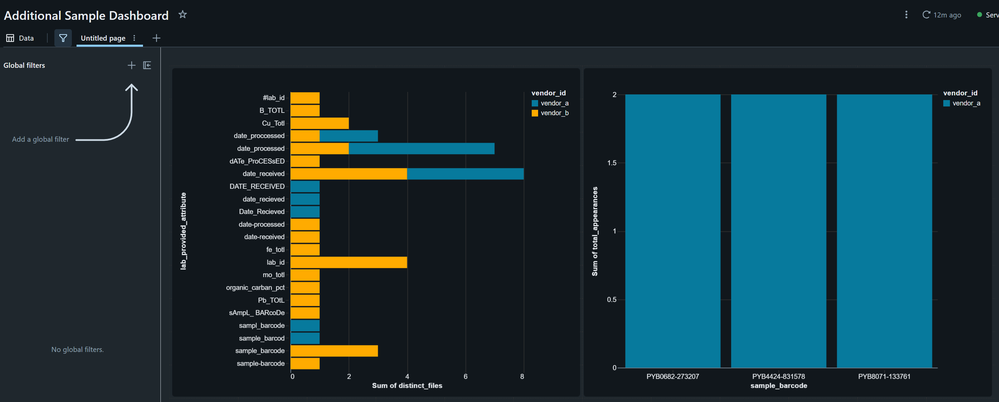

# Tests Pass, Data Lies: Observability for Data Pipelines

A vendor submitted a file with duplicate sample barcodes. Not a misconfiguration,
not a code bug. The vendor sent the same barcode twice, for different samples,
across two files. Every test passed. The results were quietly wrong for three days
before anyone noticed.

This is not a story about bad vendors. It is a story about the gap between what
tests can verify and what actually happens when real data arrives.

The code for this post can be found [here](https://github.com/aawiegel/zen_bronze_data).
Feel free to follow along or dig in if you want more details.

## But We Had Tests

The testing pyramid is real and useful. Unit tests verify that individual functions
behave correctly. Integration tests verify that components work together. The dbt
unit tests from the previous posts verify that SQL models produce expected outputs
given fixture inputs you designed. All of that is valuable, and all of it is limited
in the same specific way.

Tests verify code behavior against inputs you control. A passing test suite confirms
the logic is sound. It does not confirm that production data resembles what you had
in mind when you wrote the fixtures. Those are different questions, and only one of
them gets answered by `dbt test`.

The duplicate barcode incident was not a logic failure. The problem was that nobody
was watching whether duplicates were arriving at all. The pipeline accepted both 
records, processed them faithfully, and produced results that were technically 
correct given what it received. Which is exactly what pipelines are supposed to do. 
The missing piece was observability: something watching the data itself, not the code.

## The Observability Layer

There is a category of pipeline failure that tests cannot anticipate: the vendor who
changes something. Not the code. The data.

Did all the expected rows actually arrive? Did the vendor quietly rename a column
between last week's ingestion and this one? Is the mapping table keeping pace with
new attributes showing up in the files? These are runtime questions about data, not
compile-time questions about code. The distinction matters because the failure modes
look different. A code bug tends to fail loudly: errors, exceptions, obviously wrong
outputs. A data issue can fail quietly and slowly, producing results that are
internally consistent and completely wrong. The pipeline hums along. Nobody notices
until someone downstream asks why the numbers changed.

The signals worth watching at the bronze layer fall into a few categories.

**Completeness.** Did the expected volume arrive? A vendor who normally delivers 800
samples and sends 80 this week has a problem, even if every row is perfectly
formatted.

**Schema drift.** Did the vendor change their column names between ingestions? The
bronze layer absorbs that gracefully. The monitor makes it visible.

**Unmapped attributes.** The silver layer standardizes through a mapping table. Any
attribute that fails to resolve surfaces with `canonical_column_id IS NULL`. Some
gaps are vendor surprises; some are honest gaps in our own implementation. The
monitor surfaces both.

**Duplicate barcodes.** This one has, as established, practical motivation.

## Bronze Monitoring Models

The monitoring layer is four dbt views built against the existing bronze and
intermediate tables. They do not transform data. They report on it.

### Row Counts

```sql
SELECT
    vendor_id,
    file_name,
    ingestion_timestamp,
    COUNT(*)                                AS total_rows,
    COUNT(DISTINCT row_index)               AS total_samples,
    COUNT(DISTINCT lab_provided_attribute)  AS distinct_attributes
FROM {{ source('bronze', 'lab_samples_unpivoted') }}
GROUP BY vendor_id, file_name, ingestion_timestamp
ORDER BY vendor_id, ingestion_timestamp DESC
```

One row per ingestion event. The distinction between `total_rows` and `total_samples`
is worth a moment: the EAV format produces one row per sample-attribute pair, so a
100-sample file with 30 attributes is 3,000 rows. Both counts are useful for
different questions.

Against static fixtures this model produces exactly one row per file and nothing
worth comparing. It earns its keep in a live pipeline where last week's
`total_samples` becomes the baseline for this week's. The model does not know whether
80 samples instead of 800 is a slow week or a truncated export. It makes the
question askable.

### Unmapped Attributes

```sql
WITH joined AS (
    SELECT * FROM {{ ref('int_lab_samples_joined') }}
),
unmapped AS (
    SELECT *
    FROM joined
    WHERE canonical_column_id IS NULL
)

SELECT
    vendor_id,
    lab_provided_attribute,
    attribute_standardized,
    COUNT(*)                    AS occurrence_count,
    COUNT(DISTINCT file_name)   AS distinct_files,
    MIN(ingestion_timestamp)    AS first_seen,
    MAX(ingestion_timestamp)    AS last_seen
FROM unmapped
GROUP BY
    vendor_id,
    lab_provided_attribute,
    attribute_standardized
ORDER BY vendor_id, occurrence_count DESC
```

The `int_lab_samples_joined` model performs a LEFT JOIN from standardized
measurements to the canonical column mapping table. Rows where
`canonical_column_id IS NULL` after that join are unmapped. This model groups those
rows by vendor and attribute, counting how often each appears and across how many
distinct files.

`first_seen` and `last_seen` are quieter than they look. An unmapped attribute that
appeared once last Tuesday is probably a one-off. An unmapped attribute appearing in
every file for three months is something the pipeline has been silently dropping from
the silver layer for three months. That is worth knowing about.

### Duplicate Barcodes

```sql
WITH standardized AS (
    SELECT * FROM {{ ref('int_lab_samples_standardized') }}
),
sample_appearances AS (
    SELECT DISTINCT
        vendor_id,
        sample_barcode,
        file_name,
        row_index
    FROM standardized
    WHERE sample_barcode IS NOT NULL
),
barcode_summary AS (
    SELECT
        vendor_id,
        sample_barcode,
        COUNT(*)                    AS total_appearances,
        COUNT(DISTINCT file_name)   AS distinct_files,
        MIN(file_name)              AS first_file,
        MAX(file_name)              AS last_file
    FROM sample_appearances
    GROUP BY vendor_id, sample_barcode
    HAVING COUNT(*) > 1
)

SELECT
    vendor_id,
    sample_barcode,
    total_appearances,
    distinct_files,
    CASE
        WHEN distinct_files = 1 THEN 'intra_file'
        ELSE 'cross_file'
    END                             AS duplicate_type,
    first_file,
    last_file
FROM barcode_summary
ORDER BY vendor_id, total_appearances DESC
```

The grain of `sample_appearances` is `(vendor_id, sample_barcode, file_name,
row_index)`. The DISTINCT on that combination means re-ingesting the same file does
not manufacture the appearance of duplicates. The monitor measures vendor behavior,
not ingestion events.

The `duplicate_type` classification splits one number into two conversations. A
barcode appearing twice in the same file points toward a vendor export problem. A
barcode appearing across two different files is a different situation: a resubmission
with corrections, or barcode assignment that is not as unique as advertised. Both are
worth flagging. They have different conversations attached to them.

A fourth model, `mon_schema_drift`, tracks attribute-level changes between
consecutive ingestions: attributes that appeared in the current file but not the
prior one, and attributes that were present before and are now gone. The static
fixtures represent a single point in time rather than a sequence of ingestion events,
so there is nothing meaningful to show here. It earns its keep in a live pipeline
where the first sign a vendor changed something is a downstream metric going quietly
NULL.

## The Dashboard



The monitoring models are useful to query. A dashboard makes them useful to glance
at.

The left panel shows unmapped attributes per vendor, ranked by how many distinct
files each one appeared across. Look at the `date_received` family: `date_received`,
`DATE_RECEIVED`, `Date_Recieved`, `date-received`, `dATe_ProCEsSED`. Same attribute,
different files, different vendors, zero consistency. None of them mapped yet. They
are standing in the unmapped column like strangers at a party who do not know they
are all cousins. The vendor breakdown makes it possible to tell at a glance whether
an unmapped attribute is one vendor's quirk or a pattern worth addressing in the
mapping table.

The right panel shows barcodes that appeared more than once. Three barcodes, each
with two appearances, all from vendor A. The dashboard does not know whether those
are errors or resubmissions. It knows they showed up twice, and it made that visible
without requiring anyone to write a query first.

That last point is the one worth holding onto. The difference between a pipeline that
surfaces anomalies and one that buries them is often not sophistication. It is
whether someone built the query and put it somewhere people actually look.

## A Note on What This Does Not Cover

The monitoring here operates at the structural level: what columns exist, what
barcodes appear, how many rows arrived. It does not examine whether the values
themselves make sense.

Numerical range checks, distribution comparisons, outlier detection: those are
value-level concerns that belong in the silver layer, where measurements have been
standardized into a form that makes comparison meaningful. A copper concentration of
2.4 ppm is only notable in context. Is that within the expected range for this
vendor? An outlier relative to this sample's history? Suspicious relative to the
other samples in the same file? The bronze layer cannot answer those questions. The
monitoring here gives the bronze layer its own voice. The silver layer will have more
to say.

## Closing the Arc

Six posts ago the problem was simple to state and deeply annoying to solve: vendors
send CSV files with unstable schemas, inconsistent column names, metadata rows where
data should be, and structural chaos that makes naive ingestion brittle. The solution
was to stop fighting the schema and let column names become data. Unpivot to EAV,
capture everything, standardize through a mapping table rather than code.

That turned out to be a better foundation than it first appeared.

Posts four and five built the silver layer on top of it: staging models that clean
and type the data, intermediate models that join and enrich it, unit tests with
fixture data that verify the transformation logic. Post five addressed where the
fixture data comes from when the real records are sensitive.

This post added the last piece: the pipeline watching itself. Tests verify that the
code does what you intend. Monitoring verifies that the data is what you expect. Both
are necessary. Neither replaces the other. A pipeline that passes all its tests but
has no visibility into what is actually flowing through it is flying without
instruments. It will eventually encounter weather it did not prepare for, and the
code will process it faithfully, and the dashboard will catch it before someone
downstream asks why the numbers changed.

The monitoring models are not complex. They are four SQL views. The point is not the
SQL. It is the habit.

---

**Complete working example:** The dbt monitoring models are in
[src/crucible/models/monitoring/](https://github.com/aawiegel/zen_bronze_data/tree/main/src/crucible/models/monitoring).
The full project, including all posts in this series, is at
[github.com/aawiegel/zen_bronze_data](https://github.com/aawiegel/zen_bronze_data).